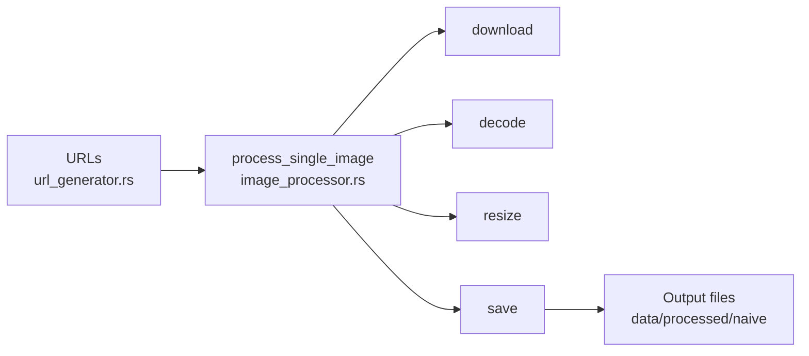
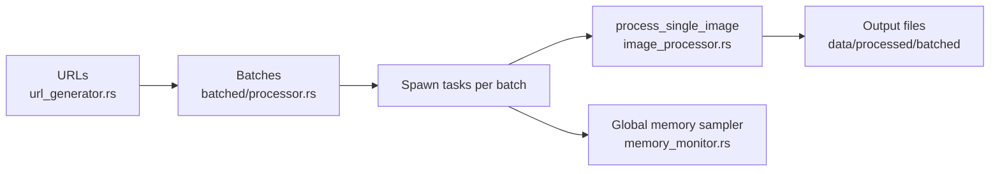
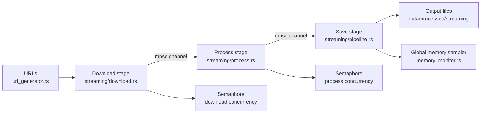

# Flux

Streaming image processing in Rust. Compare naive, batched, and streaming pipelines while tracking time and memory.

Inspired by Daft’s blog post: [Processing 300K Images Without OOM](https://www.daft.ai/blog/processing-300k-images-without-oom)

## What It Does
- Downloads images from Lorem Picsum
- Processes images via three approaches: naive, batched, streaming
- Tracks time, memory, and throughput
- Outputs a comparison table

## Architecture
Pipeline: download → process → save

Add your diagram here (Excalidraw): `docs/flux-architecture.excalidraw`.

### Codebase Architecture (Mermaid)

**Naive (src/naive + src/image_processor)**


**Batched (src/batched)**


**Streaming (src/streaming)**


## Quick Start

```bash
# Run all pipelines (default: 200 images)
RUST_LOG=info cargo run -- 200

# Smaller run for quick sanity check
RUST_LOG=info cargo run -- 20
```

Outputs are written to:
```
data/processed/naive
data/processed/batched
data/processed/streaming
```

## CLI

```bash
cargo run -- <image_count>
```

If no argument is provided, Flux defaults to **200** images.

## Logging

Flux uses `tracing`.

```bash
RUST_LOG=info cargo run -- 50
RUST_LOG=debug cargo run -- 50
```

## Results

Flux prints a comparison table after running all three pipelines.
Example format:

```
Approach | Images | Time (ms) | Peak Mem (MB) | Avg DL (ms) | Avg Resize (ms) | Throughput (img/s)
```

### Example Results (1000 images)

**Test machine**
- MacBook Pro (14-inch, 2023)
- Apple M2 Pro (10-core), 16 GB RAM
- macOS Sequoia 15.7.3 (arm64)

```
Approach | Images | Time (ms) | Peak Mem (MB) | Avg DL (ms) | Avg Resize (ms) | Throughput (img/s)
naive     1000      850341       91             302           415             1.18
batched   1000      146564       210            548           500             6.82
streaming 1000      77831        263            289           769             12.85
```

**Speedups (time):**
- Batched is **5.80x faster** than naive
- Streaming is **10.93x faster** than naive
- Streaming is **1.88x faster** than batched

**Throughput (img/s):**
- Batched is **5.80x higher** than naive
- Streaming is **10.93x higher** than naive
- Streaming is **1.88x higher** than batched

**Peak memory (MB):**
- Batched is **2.31x higher** than naive
- Streaming is **2.89x higher** than naive
- Streaming is **1.25x higher** than batched

## Project Structure

```
src/
├── main.rs                  # CLI + pipeline runner
├── url_generator.rs         # Lorem Picsum URLs
├── image_processor.rs       # Single-image baseline
├── memory_monitor.rs        # Process memory tracking
├── naive/                   # Sequential pipeline
├── batched/                 # Batched pipeline
└── streaming/               # Streaming pipeline (channels + backpressure)
```

## Notes
- Network variability affects timings
- Picsum images are random but stable via seeds
- Streaming pipeline uses bounded channels for backpressure

## Next Steps
- TUI for live metrics
- Benchmark exports (CSV + charts)
